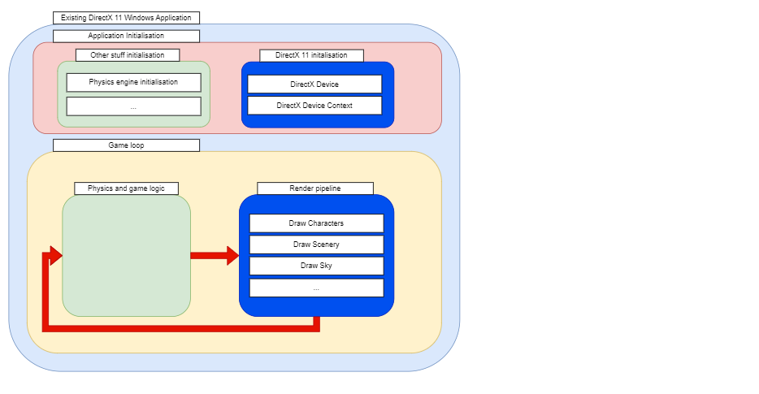
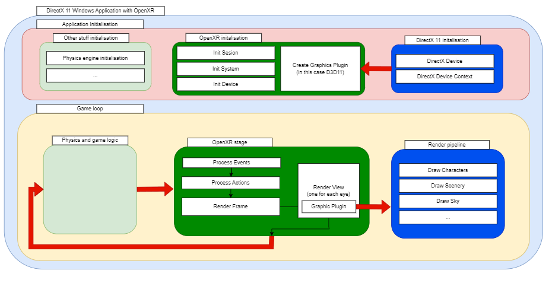
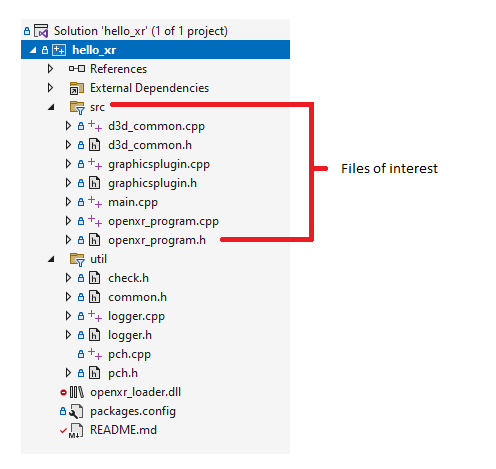

### Simplified OpenXR hello_xr for Windows Platform and DirectX 11

#### Introduction
[hello_xr sample](https://github.com/KhronosGroup/OpenXR-SDK-Source/tree/main/src/tests/hello_xr) for [OpenXR](https://www.khronos.org/openxr/) can be a little bit confusing. It actually has all needed to run the sample in windows, linux, android and for different graphic libraries like OpenGL, OpenGL ES, DirectX 11, DirectX 12, Vulkan,...

Because of this it can be a little be overwhelming for somebody having first contact with OpenXR

In this sample I've taken the hello_xr sample and I've cleaned it up to support only Windows and have only DirectX 11.
The objective of adding OpenXR support for an existing application to be able to do VR in Windows with OpenXR and any of its existing runtimes (SteamVR, WMR, Oculus,...)

As hypothetically the existing application won't be migrated to any other platform (it probably will run in Windows forever) and it's already implemented in DirectX 11 this is the only graphic plugin that will be supported. In the future, if Vulkan, DirectX 12 or any other graphic library would be supported then we would see how to add OpenXR needed graphic plugin.

#### Conceptual

Actually we have an application that is running with DirectX 11 and Windows.

This is a simplified view of its very basic architecture.

We would like to pass from architecture represented above to this, introducing OpenXR support for PCVR:

For doing so the best would be to:

- Initialise DirectX Device and Device Context and pass them to GraphicPlugin D3D11 initialisation.
- Then, inside the GraphicPlugin RenderView method all drawing should be done.
- OpenXR will communicate with computer OpenXR runtime (SteamVR, WMR, Oculus) and then, from there, to the active headset.

#### Some technical details

The original hello_xr project has been quite simplified.

- Platforms have been removed (Android, Linux). Only Windows left.
- All graphic plugins besides D3D11 has been removed
- No CMake anymore. Now using Nuget package manager for getting OpenXR loader dependency.
- Only for windows and VS2022 solutions.
- The sample doesn't render anything. In the original sample some cubes were drawn. Here only a light blue background.
- d3d_common.h/.cpp could be deleted and introduced into graphicsplugin.h/.cpp directly.

Most of the important files can be found in the src group folder in VS2022.

There are some utils, they could be removed with minor work.

#### How to run
To run, just compile the project in either Debug or Release (Nuget packages should be downloaded automatically) and launch the application.
**IMPORTANT:** SteamVR (or whatever OpenXR runtime is active on your machine) should be running and your headset connected.

#### Credits
All of this is based on [hello_xr sample](https://github.com/KhronosGroup/OpenXR-SDK-Source/tree/main/src/tests/hello_xr) by [Khronos  group](https://https://www.khronos.org/)

I've just simplified the original sample to make it easier to understand for people having first contact with OpenXR.
